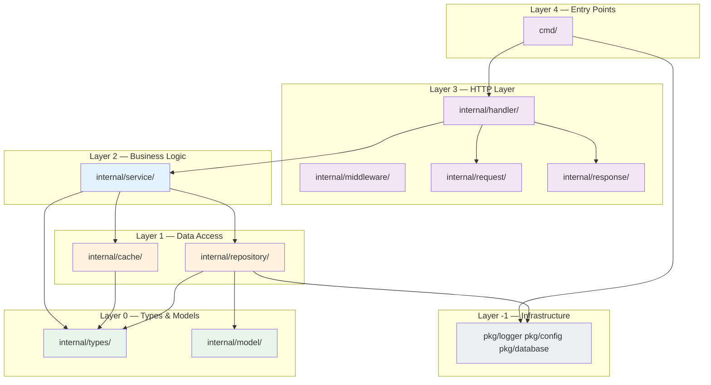
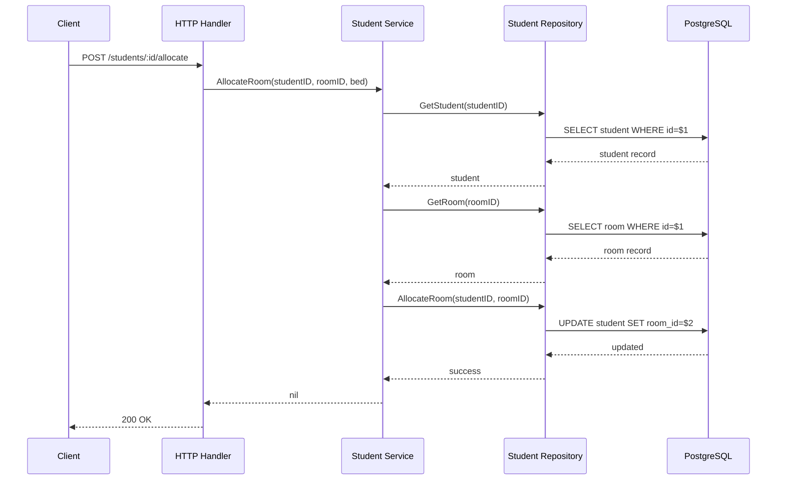

# 架构

> 项目初始化时间：2026-05-07
> 状态：绿地项目 — 结构已定义，实现待进行

## 1 概述

一个学生宿舍管理系统，提供以下功能：
- **学生管理** — 入住登记、状态追踪、入住/退宿办理
- **楼栋与房间管理** — 宿舍楼栋、房间、床位分配
- **分配引擎** — 基于性别、年级、偏好进行自动/手动房间分配
- **费用管理** — 住宿费、押金、水电费追踪
- **巡查记录** — 房间状况追踪

技术栈：Go（后端 REST API）+ Vue3（前端）+ PostgreSQL + Redis

## 2 系统架构

### 2.1 包依赖图



### 2.2 层级结构

| Layer | Packages | Can Import | Cannot Import | Purpose |
|-------|----------|------------|---------------|---------|
| L0 | `internal/types/`, `internal/model/` | stdlib only | anything internal | Shared types, DB entities |
| L1 | `internal/repository/`, `internal/cache/` | L0 | L2+ | Data access |
| L2 | `internal/service/` | L0, L1 | L3+ | Business logic |
| L3 | `internal/handler/`, `internal/middleware/`, `internal/request/`, `internal/response/` | L0, L1, L2 | L4 (cmd) | HTTP handling |
| L4 | `cmd/server`, `cmd/migrate`, `cmd/seed` | all | — | Entry points |
| L-1 | `pkg/logger`, `pkg/config`, `pkg/database` | stdlib | — | Infrastructure (any layer can import) |

### 2.3 禁止的依赖关系

| From | To | Why Forbidden |
|------|----|---------------|
| `internal/types/` | any internal | Types must be dependency-free |
| `internal/service/` | `internal/handler/` | Business logic must not know about HTTP |
| `internal/repository/` | `internal/service/` | Data access must not know about business logic |

> Enforced by: [`scripts/lint-deps.go`](scripts/lint-deps.go)

### 2.4 前端层级结构 (Vue3)

| Layer | Directory | Can Import | Cannot Import | Purpose |
|-------|-----------|------------|---------------|---------|
| L0 | `src/types/` | stdlib only | any internal | Shared TS interfaces |
| L1 | `src/api/` | L0 | L2+ | API client calls |
| L2 | `src/stores/` | L0, L1 | L3+ | Pinia state management |
| L3 | `src/views/` | L0-L2 | L4 | Page components |
| L4 | `src/components/` | L0-L3 | — | Reusable UI components |

> Enforced by: [`scripts/lint-deps.ts`](scripts/lint-deps.ts)

## 3 核心组件

### 3.1 学生管理

**目的**：学生入住登记、状态追踪、入住/退宿办理
**位置**：`internal/service/student_svc.go`
**关键实体**：`Student`、`Allocation`

### 3.2 房间分配引擎

**目的**：基于性别、年级、偏好将学生匹配至可用床位
**位置**：`internal/service/allocation_svc.go`（待实现）

### 3.3 楼栋与房间管理

**目的**：宿舍库存管理
**位置**：`internal/service/building_svc.go`、`internal/service/room_svc.go`

## 4 数据流

### 4.1 学生入住流程



## 5 关键设计决策

| # | Decision | Rationale | Alternatives Considered |
|---|----------|-----------|------------------------|
| 1 | Layered architecture (L0-L4) | Enforces clean dependencies, testable | Flat structure (rejected: harder to maintain) |
| 2 | Separate `types` and `model` packages | Types for API, models for DB | Combined (rejected: coupling) |
| 3 | `pkg/` as shared infrastructure | Logger, config, DB can be imported by any layer | Inline (rejected: duplication) |
| 4 | Pinia stores in frontend | Type-safe state management with Vue3 | Vuex (rejected: verbose) |

## 6 模块与依赖

```
module github.com/example/dormitory-management
go 1.22
```

**关键依赖**：
| Dependency | Version | Purpose |
|------------|---------|---------|
| `gin-gonic/gin` | v1.9 | HTTP framework |
| `jackc/pgx` | v5.5 | PostgreSQL driver |
| `go-redis/redis` | v9.4 | Redis client |
| `golang-jwt/jwt` | v5.2 | JWT authentication |
| `go-playground/validator` | v10 | Request validation |

## 参见

- [开发环境搭建](DEVELOPMENT.md) — 构建和测试命令
- [质量评分](QUALITY_SCORE.md) — 质量追踪
- [API 参考](references/api.md) — REST API 文档（待添加）
